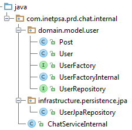
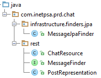
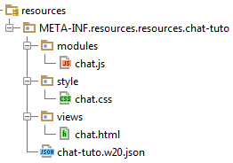

# Build a function in 20 min.
We will build a simple function for Seed. This function will provide a mini chat with a backend and a W20 screen. 
Our function will have UI, so we will use the Seed Business Framework.

# Generate the project

Generate the function project from the archetype with the above command line.

    mvn org.seedstack.tools:seed-maven-plugin:scaffold-project -Dtype=function -DgroupId=org.myorg.myproject -DartifactId=chat-tutorial-function

You can alter the groupId and artifactId values to fit your conventions. Import the created project in your favorite IDE.

## Dependency management

Start by adding the dependency management for Seed, Seed Business Framework and Hibernate in your pom root.

        <dependencyManagement>
        <dependencies>
            <dependency>
                <groupId>org.seedstack</groupId>
                <artifactId>seed-bom</artifactId>
                <version>X.X.X</version>
                <type>pom</type>
                <scope>import</scope>
            </dependency>
            <dependency>
                <groupId>org.seedstack.business</groupId>
                <artifactId>seed-business-bom</artifactId>
                <version>X.X.X</version>
                <type>pom</type>
                <scope>import</scope>
            </dependency>
            <dependency>
                <groupId>org.seedstack</groupId>
                <artifactId>seed-hibernate-bom</artifactId>
                <version>${seed-poms.version}</version>
                <type>pom</type>
                <scope>import</scope>
            </dependency>
        </dependencies>
    </dependencyManagement>

Specify the Seed poms version in the properties.

    <seed-poms.version>X.X.X</seed-poms.version>

Always prefer the latest version.

# Create the model

Our domain will have one aggregate. It will contain an aggregate root `User` and a value object `Post`. 

The domain is not part of the API so it will be in the core module under the package `internal` 
(`org.myorg.myproject.chat.internal`). This package will contain the domain model and the persistence infrastructure.

Add the dependency to `org.seedstack.seed:seed-core-support-core`, `org.seedstack.business:business-jpa` and the JPA 
specs to the core pom.

Create an aggregate root `User` which will have a list of `Post`. Also add it in the `persistence.xml`.

    @Entity
    public class User extends SimpleJpaAggregateRoot<String> {
    
        @ElementCollection
        private List<Post> posts;
    
        User() {
        }
    
        User(String name, List<Post> posts) {
            this.entityId = name;
            this.posts = posts;
        }
    
        public void addPost(String message) {
            this.posts.add(new Post(message, new Date()));
        }
    
        public List<Post> getPosts() {
            return this.posts;
        }
    }

Then create a value object `Post` which will have a message and a creation date.

    @Embeddable
    public class Post extends BaseValueObject {
    
        private String message;
    
        private Date sentAt;
    
        Post() {
        }
    
        Post(String message, Date sentAt) {
            this.message = message;
            this.sentAt = sentAt;
        }
    
        public String getMessage() {
            return message;
        }
    
        public Date getSentAt() {
            return sentAt;
        }
    
    }

Add the repository:

    public interface UserFactory  extends GenericFactory<String> {
        User createUser(String name);
    }

And the factory: 

    public class UserFactoryInternal extends BaseFactory<String> implements UserFactory {
        @Override
        public User createUser(String name) {
            return new User(name, new ArrayList<Post>());
        }
    }

In the `infrastructure.persistence.jpa` package:

    public class UserJpaRepository extends GenericJpaRepository<User, String>  implements UserRepository {
        
    }

Now that we have our model ready, make an integration test creating a `User` with a `Post` and retrieve it. Don't forget 
to add the dependencies needed for the tests (hibernate-entitymanager and hsql).

# Create a programmatic API

The chat function API will provide a service to post messages. The above interface will be in the `*-specs` module.

    package org.myorg.myproject.chat.api;
    
    import org.seedstack.seed.business.api.interfaces.annotations.InterfacesService;
    
    @Service
    public interface ChatService {
    
        void sendMessage(String user, String message);
        
    }

{}
Don't forget to add the dependency to `org.seedstack.business:business-specs`.
{}

And its implementation will be in the `*-core` module under the `internal` package.

    package org.myorg.myproject.chat.internal;
    
    import org.myorg.myproject.chat.api.ChatService;
    import org.myorg.myproject.chat.internal.domain.model.user.User;
    import org.myorg.myproject.chat.internal.domain.model.user.UserFactory;
    import org.myorg.myproject.chat.internal.domain.model.user.UserRepository;
    
    import javax.inject.Inject;
    
    public class ChatServiceInternal implements ChatService {
    
        @Inject
        private UserRepository userRepository;
    
        @Inject
        private UserFactory userFactory;
    
        @Override
        public void sendMessage(String userName, String message) {
            User user = userRepository.load(userName);
            if (user == null) {
                user = userFactory.createUser(userName);
            }
            user.addPost(message);
            userRepository.save(user);
        }
    }

Our service is now injectable by project importing the `*-core` module. Now we will use it in our `*-web` module.

# Expose the domain

In this chapter, we will build a Web API exposing a REST resource to get all messages and post new messages.

When building a function you should avoid to use composite. So you have to add all the needed dependencies in your pom.

    <dependency>
        <groupId>org.myorg.myproject</groupId>
        <artifactId>chat-tutorial-function-core</artifactId>
        <version>${project.version}</version>
    </dependency>
    <dependency>
        <groupId>org.seedstack.seed</groupId>
        <artifactId>seed-web-support-core</artifactId>
    </dependency>
    <dependency>
        <groupId>org.seedstack.seed</groupId>
        <artifactId>seed-rest-support-core</artifactId>
    </dependency>
    <dependency>
        <groupId>org.seedstack.business</groupId>
        <artifactId>business-web</artifactId>
    </dependency>
    <dependency>
        <groupId>org.hibernate.javax.persistence</groupId>
        <artifactId>hibernate-jpa-2.0-api</artifactId>
        <scope>provided</scope>
    </dependency>

First, create a finder to retrieve all the messages posted by users.

    package org.myorg.myproject.chat.rest;
    
    import org.seedstack.seed.business.api.interfaces.query.finder.Finder;
    
    import java.util.List;
    
    @Finder
    public interface MessageFinder {
    
        List<PostRepresentation> findMessages();
    }

The finder interface define a method `findMessage()` returning a list of `PostRepresentation`. This representation will 
contain the sender name, the message and the date the message was sent.

    package org.myorg.myproject.chat.rest;
    
    import java.util.Date;
    
    public class PostRepresentation {
    
        private String sender;
    
        private String message;
    
        private Date sentAt;
    
        public PostRepresentation() {
        }
    
        public PostRepresentation(String sender, String message, Date sentAt) {
            this.sender = sender;
            this.message = message;
            this.sentAt = sentAt;
        }
    
        // TODO Generate getters and setters
    }

Now implements the finder with JPA criteria.

    package org.myorg.myproject.chat.infrastructure.finders.jpa;
    
    import org.myorg.myproject.chat.internal.domain.model.user.Post;
    import org.myorg.myproject.chat.internal.domain.model.user.User;
    import org.myorg.myproject.chat.rest.MessageFinder;
    import org.myorg.myproject.chat.rest.PostRepresentation;
    
    import javax.inject.Inject;
    import javax.persistence.EntityManager;
    import javax.persistence.criteria.CriteriaBuilder;
    import javax.persistence.criteria.CriteriaQuery;
    import javax.persistence.criteria.Root;
    import java.util.ArrayList;
    import java.util.List;
    
    public class MessageJpaFinder implements MessageFinder {
    
        @Inject
        private EntityManager entityManager;
    
        @Override
        public List<PostRepresentation> findMessages() {
            CriteriaBuilder cb = entityManager.getCriteriaBuilder();
            CriteriaQuery<User> q = cb.createQuery(User.class);
            Root<User> k = q.from(User.class);
            q.select(k);
            List<User> users = entityManager.createQuery(q).getResultList();
            List<PostRepresentation> representations = new ArrayList<PostRepresentation>();
            for (User user : users) {
                for (Post post : user.getPosts()) {
                    representations.add(new PostRepresentation(user.getEntityId(), post.getMessage(), post.getSentAt()));
                }
            }
    
            return representations;
        }
    }

Finally, create a REST resource exposing the messages and allowing to post new message. The `ChatResource` should be 
transactional and you should specify the domain unit, in order to not collide with function user domain unit.

    package org.myorg.myproject.chat.rest;
    
    import org.myorg.myproject.chat.api.ChatService;
    import org.seedstack.seed.persistence.jpa.api.JpaUnit;
    import org.seedstack.seed.security.api.annotations.RequiresPermissions;
    import org.seedstack.seed.transaction.api.Transactional;
    
    import javax.inject.Inject;
    import javax.ws.rs.*;
    import javax.ws.rs.core.Context;
    import javax.ws.rs.core.MediaType;
    import javax.ws.rs.core.Response;
    import javax.ws.rs.core.UriInfo;
    
    @JpaUnit("chat-tuto-domain")
    @Transactional
    @Path("/chat")
    public class ChatResource {
    
        @Inject
        private MessageFinder messageFinder;
    
        @Inject
        private ChatService chatService;
    
        @GET
        @Produces(MediaType.APPLICATION_JSON)
        public Response getMessages() {
            return Response.ok(messageFinder.findMessages()).build();
        }
    
        @POST
        @Consumes(MediaType.APPLICATION_JSON)
        @Produces(MediaType.APPLICATION_JSON)
        public Response sendMessage(PostRepresentation message, @Context UriInfo uriInfo) {
            chatService.sendMessage(message.getSender(), message.getMessage());
            return Response.ok().build();
        }
    }

# Secure the API

As our function is simple we will have two permission one for sending messages (`prd:chat:post:send`) and the other for 
read messages (`prd:chat:post:read`). The only things to do for securing the API is to add the `seed-security-support-specs` 
in the `*-specs` module and add the `@RequiresPermissions` annotation on methods to secure.

In the `ChatService`.

    @Service
    public interface ChatService {
    
        @RequiresPermissions("prd:chat:post:send")
        void sendMessage(String user, String message);
    }

In the `ChatResource`.

    @GET
    @RequiresPermissions("prd:chat:post:read")
    @Produces(MediaType.APPLICATION_JSON)
    public Response getMessages() {
        return Response.ok(messageFinder.findMessages()).build();
    }
    
    @POST
    @RequiresPermissions("prd:chat:post:send")
    @Consumes(MediaType.APPLICATION_JSON)
    @Produces(MediaType.APPLICATION_JSON)
    public Response sendMessage(PostRepresentation message, @Context UriInfo uriInfo) {
        chatService.sendMessage(message.getSender(), message.getMessage());
        return Response.ok().build();
    }

# Create the W20 UI

The W20 code will be in `META-INF.resources.resources.chat-tuto` with the following architecture.

Start by configuring the w20 routes and the modules.

    {
        "id": "chat-tuto",
        "name": "Chat function tutorial",
        "version": "1.0.0",
    
        "modules": {
            "style": {
                "path": "[css]!{tuto-chat}/style/chat.css",
                "autoload": true
            },
            "chat": {
                "path": "{chat-tuto}/modules/chat",
                "autoload": true,
                "config": {
                    "chatRestPrefix": "${seed-rest-path}/chat"
                }
            }
        },
    
        "routes": {
            "chat": {
                "templateUrl": "{chat-tuto}/views/chat.html",
                "controller": "ChatController",
                "security": "hasPermission('seed-w20', ['prd','chat','post','read'])"
            }
        }
    
    }

{}
Notice that the `chat` route will only be visible by users with the `prd:chat:post:read` permission.
{}

Create the chat module. This module will have a service to request our REST resource and a controller with methods to 
retrieve and send messages.

    define([
        'module',
        'require',
        '{w20-core}/libext/angular/angular',
        '{w20-core}/libext/angular/angular-sanitize',
        "{w20-core}/modules/security",
        '{w20-core}/libext/angular/angular-resource'
    ], function (_module, require, angular) {
        'use strict';
    
        var _config = _module && _module.config() || {};
    
        var module = angular.module('chat', [ 'ngResource', 'ngSanitize', 'w20CoreSecurity' ]);
    
        module.factory('chatService', ['$resource', function ($resource) {
            return {
                message: $resource(_config.chatRestPrefix, {},
                    {send: {method: 'POST', params: {}}}
                )
            };
        }]);
    
        module.controller('ChatController', [ '$scope', 'chatService', 'AuthorizationService',
                function ($scope, chatService, authorizationService) {
    
                    $scope.authorization = authorizationService;
                    $scope.restPrefix = _config.chatRestPrefix;
                    $scope.sender = "";
                    $scope.newPost = "";
                    $scope.posts = [];
    
                    $scope.getMessages = function () {
                        chatService.message.query({}, function(data) {
                            $scope.posts = data;
                            $scope.newPost = "";
                        });
                    };
    
                    $scope.send = function () {
                        chatService.message.send({sender: $scope.sender, message: $scope.newPost}, function () {
                                $scope.getMessages();
                                console.log("Message sent.");
                            },
                            function (response) {
                                console.log("Failed to send message: " + response.status);
                            });
                    };
    
                    $scope.getMessages();
    
                }]);
    
    // Expose the angular module to W20 loader
        return {
            angularModules: [ 'chat' ]
        };
    }) ;

Here is a simple HTML view (the CSS is left as exercise).

{}
Notice that the submit button will only be enable to users with the `prd:chat:post:send` permission.
{}

    <section id="chat" class="container">
        

            

                <form data-ng-submit="send()" class="form-inline" role="form">
                    <input id="sender" name="sender" type="text" class="form-control" data-ng-model="sender"
                           placeholder="Enter a pseudo"/>
                    <input id="newMessage" name="newMessage" type="text" class="form-control" data-ng-model="newPost"
                           placeholder="Enter a message"/>
                    <button type="submit" class="btn btn-default" data-ng-disabled="!authorization.hasPermission('seed-w20', ['prd', 'chat', 'post', 'send'])">Send</button>
                </form>
            

        

        

            

                

                    {{post.sender}} : {{ post.message }}
                

            

        

    </section>

# Embed the function in a scaffold project

Now we have a complete function but since it is not package as WAR, we need another project to embed our function. So 
generate a scaffold project with the [Seed maven plugin](#!/seed-maven-plugin-doc/scaffold-project). Then, add the bom 
of our function in the root pom and add the web dependency in the web module. Then, configure the function persistence 
and security as follow:

    [org.seedstack.seed]
    persistence.jpa.units = chat-tuto-domain
    
    transaction.manager = org.seedstack.seed.transaction.internal.LocalTransactionManager
    transaction.default-handler = org.seedstack.seed.persistence.jpa.internal.JpaTransactionHandler
    
    [org.seedstack.seed.persistence.jpa.unit.chat-tuto-domain.property]
    javax.persistence.jdbc.driver=org.hsqldb.jdbcDriver
    javax.persistence.jdbc.url=jdbc:hsqldb:mem:testdb
    javax.persistence.jdbc.user=sa
    javax.persistence.jdbc.password=
    hibernate.dialect=org.hibernate.dialect.HSQLDialect
    hibernate.hbm2ddl.auto=create
    sql.enforce_strict_size=true
    
    [org.seedstack.seed.security]
    realms = ConfigurationRealm
    ConfigurationRealm.role-mapping = ConfigurationRoleMapping
    ConfigurationRealm.role-permission-resolver = ConfigurationRolePermissionResolver
    [org.seedstack.seed.security.users]
    john = password, PRD.DEVELOPER
    admin = password, PRD.ADMIN
    [org.seedstack.seed.security.permissions]
    admin = prd:chat:post:read
    developer = prd:chat:post:read, prd:chat:post:send
    [org.seedstack.seed.security.roles]
    developer = PRD.DEVELOPER
    admin = PRD.ADMIN
    [org.seedstack.seed.security.urls]
    /** = authcBasic
    
    # clean props section
    []

Now you should be able to run the scaffold project with tomcat and see the chat after logged in as "john". 

---

{}
**Congratulations** you have built your first SeedStack function add-on!
{}
