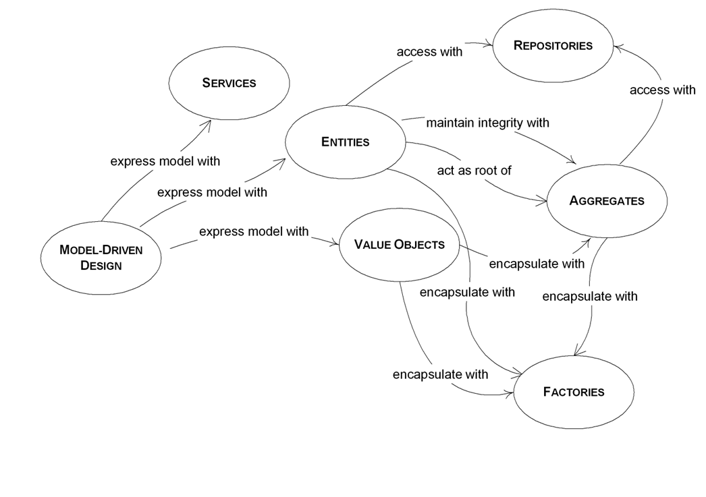

Domain-Driven Design is a software approach built on the idea of solving business problems through code. This is done by 
focusing on the heart of the business logic, to distill a design that can solve business problems.

**The business framework** helps with the implementation of that domain model. It also provides default implementations and 
helpers to quickly address related needs like model mapping or pagination. 

## What is DDD ?

**Domain-Driven Design (DDD)** is a term coined by Eric Evans in [his book]() 
"Domain-Driven design", published in 2003. It is an approach of software development that:

* Focuses on the _core domain_.
* Explores models in a creative collaboration between business experts and the software team.
* Defines an ubiquitous language within an explicitly _bounded context_.

DDD really shines when applied on medium to complex business needs but can also be used successfully on simpler projects, 
especially since the business framework considerably lowers the cost of implementing such projects by providing many 
helpers and base implementations.

Domain-Driven Design has two sides, both equally important: 

* **Strategic design**, which address high-level considerations of domain knowledge and its modeling.
* **Tactical design**, which propose practical patterns to design the required software.

{}
The business framework, being an implementation framework, naturally focuses on the tactical side of DDD. Nonetheless,
strategic design should not be overlooked and is a critical aspect of designing sustainable software.
{}

## A few definitions

### Domain
A sphere of knowledge, influence, or activity. The subject area to which the user applies a program is the domain of the software.

### Model
A system of abstractions that describes selected aspects of a domain and can be used to solve problems related to that domain.

### Ubiquitous language
A language structured around the domain model and used by all team members within a bounded context to connect all the activities of the team with the software.

### Context
The setting in which a word or statement appears that determines its meaning. Statements about a model can only be understood in a context.

### Bounded context
A description of a boundary (typically a subsystem, or the work of a particular team) within which a particular model is defined and applicable.

## Strategic design

Strategic design has nothing to do with code. It is about identifying and understanding the business mindset, language and 
solutions. Ultimately, a significant part of the domain knowledge will be implemented as code but it needs to be well
understood and structured first.

## Tactical design

The following diagram represents the key patterns of tactical Domain-Driven Design and how they relate to each other. 

{}
Go further by reading source material described in the [bibliography]().
{}
