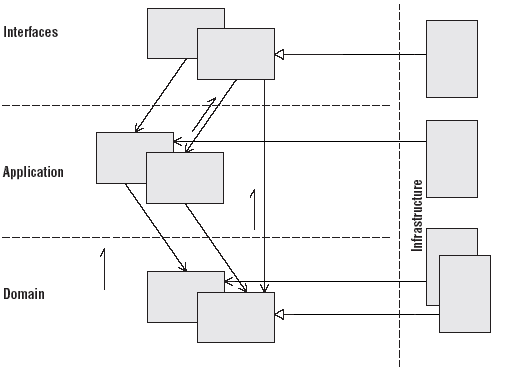

This manual will begin by to introducing and explaining all the concepts that you will need to know and master to build
successful business applications. These concepts come from the DDD software approach which is central to the Business
framework.<!--more--> You will NOT be presented with in-depth coverage of all the DDD subtleties, so to go beyond the basics you
should have a look at the [bibliography](). Moreover, links will be provided in the text when related
quality content is available.

Domain-Driven Design is **more about a way of thinking than about code** but this approach has nonetheless a great
impact on the way your business will be coded. DDD does not introduce new concepts or design patterns on its own. As
a matter of fact, you will surely recognize some patterns you already know behind DDD names. It goes beyond design
patterns though, as it dictates when, where and how to use them to solve real business problems. 

{}
As its name suggest, DDD is focused on the business and its model. This model exists independently of applications and
specific use cases and should be designed a such. Applications are clients of the model: software that will use this 
model to address enterprise needs. Naturally, particular use cases and UI ideas can be used as inputs for thinking about
the model as the software is produced. But the model itself should be independent of its clients.  
{}

# Big picture

The following diagram represents the key concepts of tactical Domain-Driven Design and how they relate to each other. 
This manual will describe all those patterns and how they can be implemented with SeedStack.


# Architecture

For starters, it is important to know that DDD doesn't require a particular architecture. Since the domain is defined
and contained inside a , it doesn't influence the architecture of the whole application
or system. There are several pertinent architectural styles that you can apply to the surroundings of the domain. Some
are very broad and tend to define every aspect of the system, others are more focused and try to address a specific
demand.

The business framework can itself adapt to several of these architectural styles. In this section we will present
the **layers architecture pattern**.

## Layers

The layers architecture pattern is commonly used in Web, enterprise and desktop applications. In this architecture
pattern, the concerns are separated into well-defined layers.

### Traditional definition

The main rule of this pattern is that each layer may couple only to itself and below. The strict layers architecture
only allows to couple to the layer directly below. We recommend to use the **relaxed layers architecture** though, which
allows any higher-level layer to couple to any layer below it.


### Dependency Inversion Principle

In the traditional view of the layers architecture, the infrastructure is at the bottom, containing technical
mechanisms like persistence, messaging or any component dependent on third-party libraries. So every upper-layer must
couple to the infrastructure layer to use the technical facilities. It is not desirable in DDD where we want to avoid
any coupling of the domain to the infrastructure. In fact we want to avoid any coupling of any layer to the
infrastructure. To achieve this independence, we will apply the **** which
states that:

> High-level modules should not depend on low-level modules. Both should depend on abstractions.

> Abstractions should not depend upon details. Details should depend upon abstractions.

What does it mean in terms of code, is that a low-level component should implement interfaces defined by high components.
As such, we can move the infrastructure layer to the side.



As an example of this architecture, we would have a `JpaCustomerRepository` implementation class which would belong to
the infrastructure and which implements the `CustomerRepository` interface defined in the domain layer. When injecting
the repository elsewhere like in services, we would only use the interface. The
[dependency injection mechanism]() of the Java framework would provide
the correct implementation from the infrastructure.

## Interface layer

The interface layer contains the components that handle **interactions with other systems**, such as Web application
views, REST resources, Web-Services, etc...

- It handles the **interpretation**, **validation** and **translation** of the inputs.
- It handles the **serialization** of the outputs, such as DTO classes to JSON, XML, etc.

## Application layer

The application layer is responsible for **driving the workflow of the application**, executing the use cases of the system.

- These operations are independent of the interfaces by which they are exposed.
- This layer is well suited for **spanning transactions**, high-level **logging** and **security**.
- The application layer is thin in terms of domain logic, it merely **coordinates the domain layer objects** to perform
the actual work through **Application Services**.

## Domain layer

The Domain Layer is where the **business is expressed**.

- The domain is independent of the use cases of the system, but is used to achieve their realization,
- It is a very **behaviour-rich** and **expressive** model of the domain, based on entities, values objects and aggregates.
- It contains additional blocks, such as domain services, repositories, factories, policies, etc...

## Infrastructure layer

The infrastructure layer contains the technology-specific implementations of interfaces defined in other layers.

- It supports all of the three other layers in different ways, facilitating communication between the layers.
- It consists of everything that would still exist without the application: external libraries, database engine,
application server, messaging backend and so on.
- This layer can be completely replaced by another one with other technological choices without altering the system behavior.

We often declare interfaces in **Interfaces**, **Application** and **Domain** layers and implement them in the
infrastructure Layer. A good example is the repository: interfaces are located in the domain layer but the
implementation is in the infrastructure.

# Supple design

> The ultimate purpose of software is to serve users. But first, that
> same software has to serve developers. [Eric Evans]

A software is not a piece code written in a one shot sprint. It is
project that evolves. A lot of developers will have to work on it, to
refactor it or add new features. Supple design is about making it
a pleasure. It should invite to change and avoid the maintenance hell.

Complex and monolithic methods make hard to refactor or reuse parts of
the code. When developers are not confident about what the software
does, they start duplicating code. When this happens, iterative
process and refactoring stops.

A supple design reveals the intent of the design. Side effects should
contained and easy to predict. Behaviour should be obvious making it
easy to reason about without having to investigate the implementation.

There is no one-way to achieve this suppleness but Eric Evans provides
us some clues with a set of patterns. We will try to define and
illustrate them.

## Intention-Revealing Interface

This concept is all about communication between developers through
code. Names of classes and methods should describe intents instead of
means. The *ubiquitous language* must be used to define these
names. It will improves the comprehension of the code by the other
members of the team.

> If a developer must consider the implementation of a component in
> order to use it, the value of encapsulation is lost.

Implementation changes should not affect the expected behaviour.

You can also make methods signatures clearer using meaningful Value
Objects and Entities rather than primitives and associated classes
(eg. String, long, BigDecimal, etc.). For instance, given the
following method:

```java
void setAddress(String address)
```

How the client developer can know what the address should look like ?
Does the model allow to change the address or is it just for
initialization purpose ? Using the concept of *Intention-Revealing
Interface* will leads us to this newer version of the method:

```java
void changeAddress(Address address)
```

## Side-Effect-Free Function

We just explained how a good naming can improve the comprehension of a
model, but this is not always enougth. Complex methods usually call a
combination of other methods. When all these nested methods have
side-effects, it become hard to predict the overall behaviour.

>In computer science side-effect means any modification in the state of
>a system.

Lets say we are working on a software managing teams. We had to
implement a method allowing to merged teams. So we first wrote this:

```java
teamOne.add(teamTwo)
```

Ok, it takes members of the *teamTwo* and add them to the
*teamOne*. It does the job. Wait ! What happens to *teamTwo* ? Has it
been modified also ? We can't be sure whithout looking at the code of
the *add* method because this method is not *side-effect-free*. After
refactoring the code, here is the second version:

```java
Team newTeam = teamOne.mergeWith(teamTwo)
```

In the newer version, *teamOne* and *teamTwo* are not
modified. Instead we create a new object, like that developers don't
have to understand the implementation. The knowledge is capture in the
newly created team. The idea here is not to remove all the
side-effects otherwise the code will just allow you to perform
queries. But side-effects should be contained in small entities
methods and complex computation isoltated in value objects.

## Assertion

In the previous section we talk about limiting side-effects. But some
of them will remains. The problem is that when they are implicit, it becomes
impossible to anticipate the changes on the state of the application
whithout following the execution path. Which breaks the
encapsulation. So in order to make them explicit use *assertions*. It
can be done using method post-condition (for instance, with `@Valid` from the
Validation JSR) or by using unit tests.

## Going further

In this article, we described methods for making intentions explicit
using *Intention-Revealing Interface*, *Side-Effect-Free Functions*
and *Assertion*. These methods allow us to communicate intents,
protecting encapsulation. This is very important if we want to keep
the advantages of using a *Object-oriented-language*. It also allow
the client developer to focus on his design instead of having
understand all the inner workings of the API he uses.

In his book "Domain Driven Design", Eric Evans go further describing
three additional concepts: *Conceptual contour*, *Standalone*,
*Closure of Operations*. I invite you to read his book if you want to
have all the tools to reach the suppleness.

# Package layout

We propose and recommend a well-defined package layout for organizing your business code, which is described in this
section.

## The domain

### Standalone domain

If you want to build a reusable domain it must be located in its own project. It is the recommended way to build a domain
because it allows to reuse it across applications and doesn't cost more than in-application domains. In that case, the
domain must be named and live in its own package, for instance:

    org.myorganization.domains.mydomain

Here the domain is named `mydomain`. Its prefix would naturally be adapted to your organization rules.

### In-application domain

If you plan to place the domain inside to your application (which is not recommended), you can just code it along
your application packages. In that case it can stay without name and live as a subpackage of your project, for instance:

    org.myorganization.myproject.domain

Here the domain is not named, as it lives under the domain subpackage of the project. The project package would naturally
be adapted to your organization rules.

### Package organization

In the DDD approach, entities are grouped in sets called aggregates. Aggregates are represented as a package containing
an aggregate root and possibly additional entities. This package also contains the factory (interface and implementation),
the repository interface and the possible value objects or policies related to your aggregate.
Value objects and policies which may be used by multiple aggregates should be placed in a shared package.
Services are located in their own package.

Implementations can be located in the `internal` subpackage if they are independent of technical aspects like a third-party
library. Otherwise they must be located in the infrastructure.


```plain
org.myorganization.domains.mydomain (can also be org.myorganization.myproject.domain for in-application domain)
    - model
        - myaggregate1
            - MyAggregateRoot
            - MyEntity1
            - MyEntity2
            - MyAggregateFactory
            - MyValueObject
            - MyRepository
            - MyPolicy
            - internal
                - MyPolicyImpl
                - MyAggregateFactoryImpl
        - myaggregate2
            ...

    - services
        - MyService1
        - MyService2
        - internal
            - MyService1Impl

    - shared
        - MySharedValueObject
        - MySharedPolicy1
        - internal
            - MySharedPolicy1Impl
```

{}
The domain should never depends on specific technical aspects. As such no infrastructure package have a place in a reusable
domain. The infrastructure for the domain should reside in the client of the domain (the application using the domain) as
it is specific to it (a same domain can be persisted very differently in different applications).
{}

## The application

The application layer contains application services which should be located in the application package. Implementations
can be in `internal` subpackages if they are independent of technical aspects (third-party library). Otherwise, they must
be located in the infrastructure package.

```plain
org.myorganization.myproject
    - application
        - services
            - MyService3
            - MyService4
            - internal
                - MyService3Impl

    - infrastructure
        - services
            - 3rdparty-lib
                - MyService4Lib
        - repositories
            - jpa
                - MyRepositoryJpa
```

{}
Note that the infrastructure also contains the implementation of domain concepts related to a specific technology, such
as implementations of repositories or of some services.
{}

## The interfaces

```plain
org.myorganization.myproject
    - rest
        - usecase1
            - UseCase1Assembler
            - UserCase1Resource
            - UseCase1Finder
            - UseCase1Representation
        - usecase2
            ...

    - infrastructure
        - finders
            - jpa
                - UseCase1FinderJpa
                - UseCase2FinderJpa
```

# Tuples

A tuple is a data structure corresponding to a sequence of immutable
objects. It's just like an array of objects but typed and which can't be changed,
i.e. tuples are immutable.

Tuples are commonly used to:

- Represent a set of data without creating temparary object
  that have no real meaning.
- Easy access to, and manipulation of, a data set.
- Returning mutliple values from a method.
- Passing multiple values to a method through a single parameter.

In the Business framework, we usually see them in factories and
assemblers. As implementation for tuples we use
[javatuples.org](http://javatuples.org). It provides tuple classes
from one to ten elements:

    Unit<A> (1 element)
    Pair<A,B> (2 elements)
    Triplet<A,B,C> (3 elements)
    Quartet<A,B,C,D> (4 elements)
    Quintet<A,B,C,D,E> (5 elements)
    Sextet<A,B,C,D,E,F> (6 elements)
    Septet<A,B,C,D,E,F,G> (7 elements)
    Octet<A,B,C,D,E,F,G,H> (8 elements)
    Ennead<A,B,C,D,E,F,G,H,I> (9 elements)
    Decade<A,B,C,D,E,F,G,H,I,J> (10 elements)

Plus a couple of very common 2-element tuple classes equivalent to
Pair, just for the sake of code semantics:

```java
KeyValue<A,B>
LabelValue<A,B>
```

All the tuple classes respect the following properties:

 * Typesafe
 * Immutable
 * Iterable
 * Serializable
 * Comparable (implements Comparable)
 * Implementing equals(...) and hashCode()
 * Implementing toString()

Usage:

```java
Pair<Integer, String> pair = new Pair<Integer, String>(10, "foo");
Integer value0 = pair.getValue0();
String value1 = pair.getValue1();
```

We also provide an helper class to create tuples.

```java
Pair<Integer, String> pair = Tuples.create(10, "foo");
Tuple tuple = Tuples.create(10, "foo", new Customer());
```

# Qualified injection

The Business framework supports the use of qualifiers defined by the JSR 330. This feature provides the ability to
create multiple implementations for the same interface. This is useful when you have multiple algorithms or implementation
technologies for an interface.

## An example with policies

This pattern can be used in various situations but proves itself very useful in the case of DDD policies. To leverage it,
define a Policy interface as follows:

```java
@Policy
public interface TaxesPolicy {

    Integer computeTaxes(Order order);
}
```

Then define an implementation annotated by a qualifier. The annotation `@Named` allows to qualify an implementation with
a String.

```java
@Named("FR")
public class FranceTaxesPolicy implements TaxesService {

    Integer computeTaxes(Order order){
        ...
    }

}
```

Finally you can inject it as follows:

```java
@Inject @Named("FR")
private TaxesPolicy frenchTaxes;

@Inject @Named("UK")
private TaxesPolicy ukTaxes;
```

Or you can select it dynamically using the :

```java
TaxesPolicy userTaxesPolicy = domainRegistry.getPolicy(TaxesPolicy.class, userLocal);
```

## Use a custom qualifier

If a qualifier is often used, you can create a custom qualifier annotation as follows.

```java
import static java.lang.annotation.ElementType.FIELD;
import static java.lang.annotation.ElementType.METHOD;
import static java.lang.annotation.ElementType.TYPE;
import static java.lang.annotation.RetentionPolicy.RUNTIME;

import java.lang.annotation.Retention;
import java.lang.annotation.Target;

import javax.inject.Qualifier;

@Qualifier
@Target({ TYPE, METHOD, FIELD })
@Retention(RUNTIME)
public @interface France {
}
```

Then you use it like the `@Named` annotation.

```java
@Inject @France
private TaxesService taxesService;
```

## List of concepts supporting qualifiers

Qualified injection can be used on these concepts out-of-the-box:

* Assembler,
* Repository,
* Factory,
* Policy,
* Service,
* Finder.
