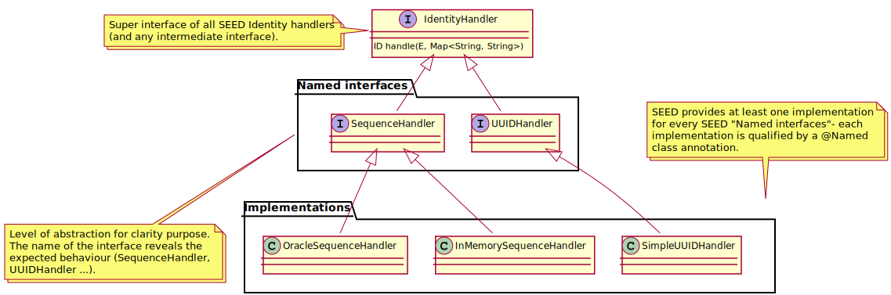
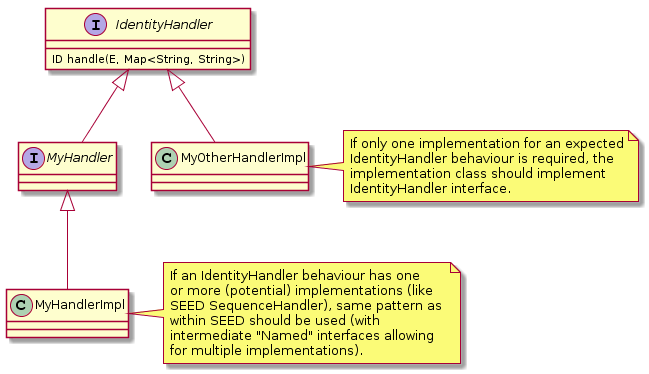

Domain objects have a lifecycle: they are created, go through various states and eventually die (either being archived
or deleted). Many of these objects are simple, transient objects which are simply created with a call to their constructor
and thrown away after use. There is no need to complicate such objects. But some objects are more rich, with a complex
lifecycle and numerous relationships with other objects. The challenges of managing these objects can be addressed by
three patterns:

* **Aggregates**, which define clear ownership and boundaries between domain objects.
* **Repositories**, which encapsulate the logic of persisting and retrieving aggregates.
* **Factories**, which encapsulate the logic of creating aggregates.

# Aggregates

Most business domains have very interconnected Entities, sometimes up to the point where there is always a path going from
any Entity to any other. We can try to minimize the number of associations in our design, and this is a good practice
but it can lead to a translation loss between business and software. In a typical object model, it is difficult to clearly
see the boundaries of a change. This is particularly acute in systems with concurrent access such as Web applications.

{}
It is difficult to guarantee the consistency of changes to objects in a model with complex associations and no clear
boundaries between objects. Considering every object as independent from each other is not a valid approach, but on the
other side, refreshing every object because of a change is not practical. A balanced solution must be found.
{}

To help us with this delicate problem, the Aggregate pattern can be applied. It is a cluster of associated objects that
are considered as a unit for the purpose of data changes. Each Aggregate has root and a boundary which determines what
is inside the Aggregate. The Aggregate root is a specific Entity contained in the Aggregate. It is the only entry-point
of the Aggregate, meaning that it is the only Aggregate Entity that client objects can hold references to. Other objects
of the Aggregate are only accessible through the context of the Aggregate root.

## Characteristics

The following rules apply to Aggregates:

* The Aggregate root has a global identity and is responsible for checking invariants within the Aggregate.
* Non-root Entities inside the Aggregate have a local identity that is only unique within the Aggregate.
* Code outside the Aggregate can only hold references to the Aggregate root. The root can hand references to internal
entities but they must only use them transiently and not hold to the reference. Value Objects can be handed without
any concern because they are immutable and side-effect free.
* Only Aggregate roots can be loaded directly from the persistence. All other objects must be found by traversal of
associations.
* Any change within the Aggregate boundary must satisfy all the Aggregate invariants.

## Declaration

Creating an Aggregate with the Business Framework, consists in:

* Creating a package with the Aggregate name,
* Create all the domain objects belonging to the Aggregate in this package,
* From all those domain objects, one Entity should be created as the **Aggregate root**. This step is the focus of this
section.

To create an Aggregate root using the Business framework you have three choices:

* Extend the `BaseAggregateRoot` class. This class directly extends `BaseEntity` and as such the `equals()`, `hashCode()`
and `compareTo()` methods will be provided out-of-the-box.
* Implement the `AggregateRoot` interface. You must implement the `equals()`, `hashCode()` and `compareTo()` methods in
this case.
* Simply annotate any class with the `@DomainAggregateRoot` annotation. In this case, you won't be able to use helpers and
tools from the framework.

With the two first options (base class and interface), you have to provide a generic parameter with the type of the
Aggregate root identifier.

## Example

    public class Order extends BaseAggregateRoot<Long> {
        private Long orderId;
        private Date checkoutDate;
        private double price;
        private List<OrderItem> items;

        Order() {
        }

        @Override
        public Long getEntityId() {
            return orderId;
        }

        public void addOrderItem(int quantity, long productId, double price) {
            OrderItem orderItem = new OrderItem();
            orderItem.setQuantity(quantity);
            orderItem.setProductId(productId);
            orderItem.setPrice(price);
            items.add(orderItem);
        }

        public void clearOrderItems() {
            items.clear();
        }

        public Long getOrderId() {
            return orderId;
        }

        ...
    }

# Repositories

A Repository is used to store and retrieve Aggregates from persistence. Aggregates are only manipulated by repositories
through their Aggregate roots.

## Default repository

The Business Framework provides a default repository that can perform CRUD actions on an aggreate.
It can be injected with the `Repository` interface and a qualifier.

```
@Inject @Jpa
private Repository<Customer, String> customerRepo;

...
Customer customer = customerRepo.load(customerId);
```

{}
By default, you have to explicitly specify the qualifier.
But if you have only one persistence and one default repository, you can configure the one to use.
The default repository can be configured for all the application:

```
[org.example.*]
default-repository=org.seedstack.jpa.Jpa
```

You can also override it for a specific aggregate root:

```
[org.example.domain.customer.Customer]
default-repository=another-qualifier
```

The `default.repository.qualifier` property expects a qualifier annotation class or a string when the qualifier use `@Named("another-qualifer")`.
{}

## Explicit repository

The default CRUD repository is interesting to start quickly and might be enough for some use cases.
But it is possible to add your own repositories, in order to extend the CRUD behavior with your domain
requirements.


First create a repository interface extending `GenericRepository`. This interface is usually located in the aggregate package.

```
import org.seedstack.business.domain.Repository;

public interface OrderRepository extends GenericRepository<Order, Long> {

     Order findOrderByCategory(String categoryId)
}
```

{}
It is possible not to use the `GenericRepository` interface and instead annotate the class with the `@DomainRepository` annotation.
But you won't be able to use the framework's helpers like the assembler DSL `fromRepository()` method.
{}

Then add an implementation in the infrastructure layer.

```
public class OrderJpaRepository extends BaseJpaRepository<Order, Long> implements OrderRepository {

    @Override
    public Order findOrderByCategory(String categoryId){ ... }
}
```

## Usage

An explicit repository can be injected like a default one (with the `Repository` interface) or with its own interface:

```
@Inject
private Repository<Order, Long> repository;
```

```
@Inject
private OrderRepository repository;
```

# Factories

A factory is used to **create domain objects**, checking that provided data is complete and consistent.

To be created by a factory the domain object must also implements `Producible`. This is necessary because all
the domain objects are not producible by a factory. For instance an entity is only be producible by an aggregate
root.

The types implementing `DomainObject` and `Producible` are the followings:

* AggregateRoot,
* DomainPolicy,
* ValueObject,
* DomainEvent,
* DomainService.

## Default factory

The default factory has a single method `create` with varargs that will match via reflection the constructor corresponding
to the passed arguments. The created domain object should implement the desired constructors:

```
public class Customer extends BaseAggregate<Long> {
    private Long id;

    Customer() {
        ...
    }

    Customer(String firstName, String lastName) { // This constructor will be called
        ...
    }
}
```

The default factory can then be injected and used by invoking its `create()` method with arguments unambiguously corresponding
to only one constructor:

```
@Inject
Factory<Customer> factory;

Customer customer = factory.create("John", "Doe");
```

One benefit over the plain constructor approach is that default factories will invoke identity generation (see [below](#identity-generation))
and/or validation automatically after object instantiation. The

As other factories this method will provide validation on the created object. But it won't survive to refactoring, so be careful using the method (ie. unit test it!).

{}
This factory can only be used to create domain objects that implement the `Producible` and `DomainObject` interfaces. Classes
extending Business framework base classes will already implement those interfaces but annotated POJO, such as policies or
services, must implement them explicitly. As an alternative, you implement the `GenericDomainPolicy` and `GenericDomainService`
interfaces instead.
{}

## Explicit factory

An explicit factory is composed of an interface, which is located in the package of the aggregate it constructs, and an
implementation which can be located either:

* In the aggregate package too,
* Or in an infrastructure package if it is dependent upon a specific technology.

The factory interface has to extend the `GenericFactory` interface:

```
package org.mycompany.myapp.domain.model.order;

import org.javatuples.Triplet;
import org.seedstack.business.domain.GenericFactory;

public interface OrderFactory extends GenericFactory<Order> {

    Order createOrder(String customerId, Date checkoutDate, Double price,
            List<Triplet<Integer, Double, Long>> orderItemTriplets);
}
```

* `Order` is the type which is the expected to be returned by all the create methods.
* `createOrder` method creates an `Order` aggregate with the required parameters. Some parameters can be grouped with a tuple like
`oderItemTriplets` which represents a list `OrderItem` entities belonging to the `Order` aggregate (See
[here](#!/business-doc/concepts/oop#tuples) for more information on tuple pattern).

The factory implementation must extend the `BaseFactory` abstract class and implement its own interface.

```
package org.mycompany.myapp.domain.model.order;

import org.javatuples.Triplet;
import org.seedstack.business.domain.BaseFactory;
import org.mycompany.myapp.domain.customer.CustomerId;

public class OrderFactoryImpl extends BaseFactory<Order> implements OrderFactory {

    @Override
    public Order createOrder(String customerId) {
        Order o = new Order();

        o.setCustomerId(new CustomerId(customerId));
        o.setCheckoutDate(new Date());

        return o;
    }
}
```

Here, the factory encapsulates the logic of creating a minimal but valid `Order` aggregate. This order can be further
populated by an assembler or by custom logic.

{}
When the implementation and its interface share the same package, the **implementation should be in package visibility**.
It prevents any direct use of the implementation.
{}

# Identity generation

Factories provide methods to create entities with a well defined identity. But sometimes, you want to delegate the identity
creation, for instance to an Oracle sequence. For this use case Seed provides an **identity generation strategies**.
A generation strategy makes sure a unique identity is provided to any new Entity before it is even persisted.

## Declaration

Below is an aggregate using the identity strategy:

```
package org.mycompany.myapp.domain.model.myaggregate;

public class MyAggregate extends BaseAggregateRoot<UUID> {

    @Identity(handler = UUIDHandler.class)
    private UUID id;

    private String name;
    private MyEntity mySubEntity;
    private Set<MyEntity> mySubEntities;
}
```

Below is an Entity using the identity strategy:

```
package org.mycompany.myapp.domain.model.myaggregate;

public class MyEntity extends BaseEntity<Long> {

    @Identity(handler = SequenceHandler.class)
    private Long id;
}
```

The `@Identity` annotation is applied on attribute holding the object identity. This annotation takes two arguments:

* `handler`: strategy implementation
* `source`: a String that can be used in a custom handler. For instance, it could provide a SEQUENCE name for DB.

Only specifying the identity strategy is not enough to effectively generate an identity. An implementation of the strategy
must be configured:

	[org.mycompany.myapp.domain.model.myaggregate.MyAggregate]
	identity.handler-qualifier = simple-UUID

	[org.mycompany.myapp.domain.model.myaggregate.MyEntity]
	identity.handler-qualifier = oracle-sequence
	identity.sequence-name = SEQ_TEST

In this case we can see that the `simple-UUID` implementation will be used for `MyAggregate`. Similarly, the `oracle-sequence`
implementation will be used for `MyEntity` but is further configured with a sequence name.

## Usage

The chosen identity strategy is applied:

* Automatically, on methods annotated with the `@Create` annotation. They are intercepted to apply the identity strategy
on their return value.

```
public class MyAggregateFactoryDefault extends BaseFactory<MyAggregate>
        implements MyAggregateFactory {

    @Create
    @Override
    public MyAggregate createMyAggregate(String name) {
        MyAggregate myAggregate = new MyAggregate();
        myAggregate.setName(name);

        MyEntity myEntity = createMyEntity();
        myAggregate.setMyEntity(myEntity);

        return myAggregate;
    }

    @Create
    MyEntity createMyEntity() {
        return new MyEntity();
    }
}
```

* Manually, by injecting the `IdentityService` service and invoking its `identify()` method with the entity to generate
an identity for as argument.

```
public class MyAggregateFactoryDefault extends BaseFactory<MyAggregate>
        implements MyAggregateFactory {

    @Inject
    IdentityService identityService;

    @Override
    public MyAggregate createMyAggregate(String name) {
        MyAggregate myAggregate = new MyAggregate();
        identityService.identify(myAggregate);
        myAggregate.setName(name);

        MyEntity myEntity = new MyEntity();
        identityService.identify(myEntity);
        myAggregate.setMyEntity(myEntity);

        return myAggregate;
    }
}
```

Note that identity generation doesn't walk the object graph to generate identities for eventual sub-entities. You must
trigger identity generation (automatically or manually) separately on each entity.

{}
If all methods of a factory delegate identity generation to Seed, a `@Create` annotation can be applied directly at the
class or interface level.
{}


## Custom identity handler



Two different options are available to define custom identity handlers:



Below is an example of a basic Timestamp id generation strategy:

```
package org.mycompany.myapp.infrastructure.domain;

import org.seedstack.business.domain.BaseEntity;
import org.seedstack.business.domain.identity.IdentityHandler;

@Named("timestamp-id")
public class TimestampIdentityHandler implements IdentityHandler<BaseEntity<Long>, Long> {

    @Override
    public Long handle(BaseEntity<Long> entity, Map<String, String> entityConfig) {
        return new Date().getTime();
    }
}
```

## Provided identity strategies

### SequenceHandler

Handles sequence generated ID. Two implementations are provided:

* `OracleSequenceHandler`: Get next oracle sequence value for new entity id. The following properties.

```
[org.mycompany.myapp...YourEntity]
identity.handler-qualifier = oracle-sequence
identity.sequence-name = your_sequence_name
```

* `InMemorySequenceHandler`: To be used **ONLY** for testing (preserves behaviour without a database). The following
properties.

```
[org.mycompany.myapp...YourEntity]
identity.handler-qualifier = inmemory-sequence
```

### UUIDHandler

Use for handling UUID generated ID. One implementation is provided:

* `SimpleUUIDHandler`: Get new random UUID from java.util.UUID.randomUUID(). Need one property using entity props
configuration:

```
[org.mycompany.myapp...YourEntity]
identity.handler-qualifier = simple-UUID
```

For a full description of Entity properties configuration, refer to this
[documentation](#!/business-doc/hands-on-domain/entity#configuration-spi).
