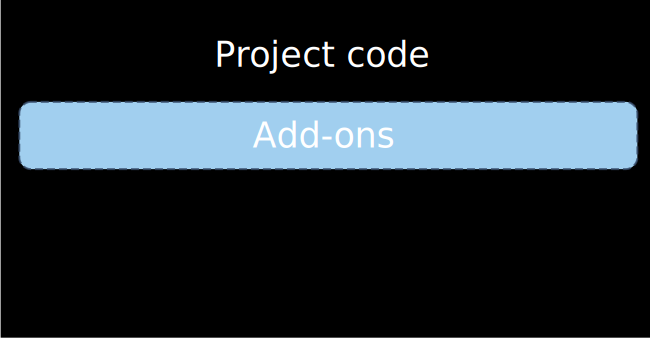

SeedStack is a Java, general purpose, development solution. It can be used to build different types of projects, 
and particularly REST-based microservices and applications.<!--more-->

The Java framework is the foundation. It can be completed with:

* With the [business framework](/docs/business) to write clean business code,
* With add-ons from the [official library](/addons),
* With third-party or custom add-ons.

# An integration stack

SeedStack is an integration solution, bringing together the best open-source libraries in a clean and consistent 
architecture. To do so, it relies on an extensible kernel/plugin architecture that is capable of automatically activating
the plugins present in the classpath.

Modern microservices and applications are composed of a great number of software components and technologies that must
be integrated with each other. Things like REST resources, persistence, business logic, caching and so on must 
be all initialized, configured and wired properly to make a system operational.

These technical and complex integration tasks are fully automated by SeedStack. By using SeedStack you directly benefit
from a clean, fully automated software architecture and from some of the best technologies open-source has to offer. **SeedStack 
allows you to focus on the high-value code and leave the plumbing to the framework.**

# A modular architecture

SeedStack has a highly modular architecture, allowing you to cherry-pick the components you need and leave off the ones 
you don't. This will make your project light and clean. At any time, you can add or remove components without any change 
to the existing codebase, so you can start small and grow step-by-step.

SeedStack is designed from the start to work in a context of reusable software components. Every feature like dependency
injection, configuration, security, REST or the business framework is designed to work across multiple modules that you
can reuse and combine as you need in multiple projects.

Also, you can leverage SeedStack architecture to provide the same level of modularity in your own add-ons. **Beyond built-in
modularity, Seedstack can be the foundation for building your own technology stack.**
